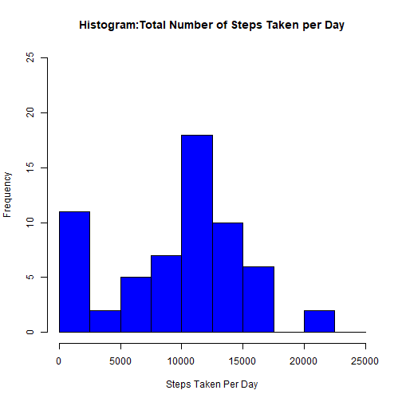
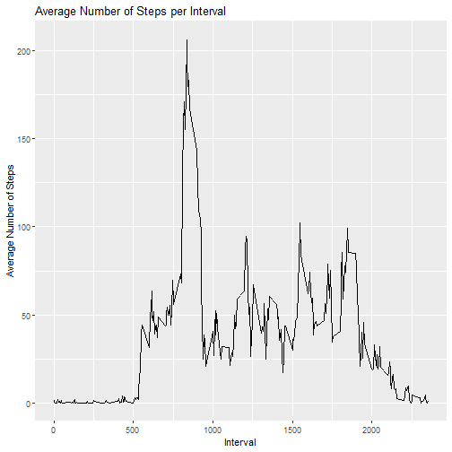
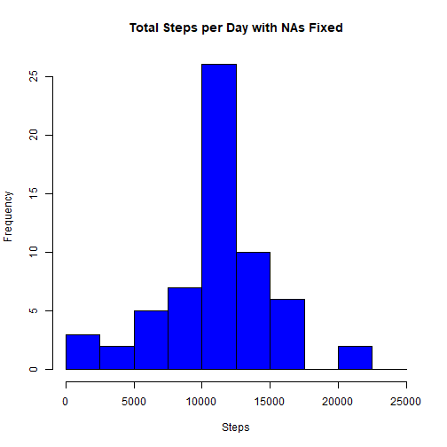
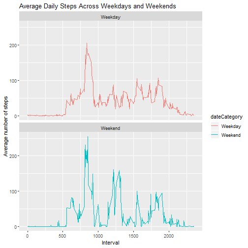

## R Markdown


```r
library(ggplot2)
library(plyr)
library(lattice)
activity_data <- read.csv("activity.csv")
head(activity_data)
```

```
##   steps      date interval
## 1    NA 10/1/2012        0
## 2    NA 10/1/2012        5
## 3    NA 10/1/2012       10
## 4    NA 10/1/2012       15
## 5    NA 10/1/2012       20
## 6    NA 10/1/2012       25
```

```r
activity_data$DateTime<- as.POSIXct(activity_data$date, format="%Y-%m-%d")
activity_weekday<- weekdays(as.Date(activity_data$date))
activity <- cbind(activity_data,activity_weekday)
head(activity)
```

```
##   steps      date interval DateTime activity_weekday
## 1    NA 10/1/2012        0     <NA>        Wednesday
## 2    NA 10/1/2012        5     <NA>        Wednesday
## 3    NA 10/1/2012       10     <NA>        Wednesday
## 4    NA 10/1/2012       15     <NA>        Wednesday
## 5    NA 10/1/2012       20     <NA>        Wednesday
## 6    NA 10/1/2012       25     <NA>        Wednesday
```

```r
summary(activity)
```

```
##      steps                date          interval         DateTime    
##  Min.   :  0.00   10/1/2012 :  288   Min.   :   0.0   Min.   :NA     
##  1st Qu.:  0.00   10/10/2012:  288   1st Qu.: 588.8   1st Qu.:NA     
##  Median :  0.00   10/11/2012:  288   Median :1177.5   Median :NA     
##  Mean   : 37.38   10/12/2012:  288   Mean   :1177.5   Mean   :NA     
##  3rd Qu.: 12.00   10/13/2012:  288   3rd Qu.:1766.2   3rd Qu.:NA     
##  Max.   :806.00   10/14/2012:  288   Max.   :2355.0   Max.   :NA     
##  NA's   :2304     (Other)   :15840                    NA's   :17568  
##   activity_weekday
##  Saturday : 1152  
##  Sunday   : 1152  
##  Tuesday  : 1152  
##  Wednesday: 1152  
##  Monday   :  864  
##  (Other)  : 1440  
##  NA's     :10656
```

##Histogram of the Total Number of Steps

```r
sum_activity <- with(activity,aggregate(steps,by = list(date), FUN=sum,na.rm = TRUE))
colnames(sum_activity)<- c("Date", "Steps")
hist(sum_activity$Steps, xlab="Steps Taken Per Day", ylab="Frequency", main = "Histogram:Total Number of Steps Taken per Day",col="blue",ylim = c(0,25),breaks = seq(0,25000, by=2500))
```


##Getting the Mean and Median of Steps taken per Day

```r
mean(sum_activity$Steps)
```

```
## [1] 9354.23
```

```r
median(sum_activity$Steps)
```

```
## [1] 10395
```
##Getting the Average Number of Steps taken per Day

```r
clean <- activity[!is.na(activity$steps),]
interval_aveg <- ddply(clean, .(interval), summarize, Aveg = mean(steps))
head(interval_aveg)
```

```
##   interval      Aveg
## 1        0 1.7169811
## 2        5 0.3396226
## 3       10 0.1320755
## 4       15 0.1509434
## 5       20 0.0754717
## 6       25 2.0943396
```

```r
q <- ggplot(interval_aveg, aes(x=interval, y=Aveg))
q + geom_line()+ggtitle("Average Number of Steps per Interval")+xlab("Interval")+ylab("Average Number of Steps")
```


##Getting the interval that contains the maximun # of Steps

```r
max_Steps <- max(interval_aveg$Aveg)
interval_aveg[interval_aveg$Aveg==max_Steps,1]
```

```
## [1] 835
```
##Imputing Missing Data

```r
imputed_steps <- interval_aveg$Aveg[match(activity$interval, interval_aveg$interval)]
imputed_activity <- transform(activity, steps = ifelse(is.na(activity$steps), yes = imputed_steps, no = activity$steps))
imputed_total <- aggregate(steps ~ date, imputed_activity, sum)
colnames(imputed_total)<- c("Date", "Steps")
```
##Histogram of the Total Number of Steps after Imputing Missing Values

```r
mean(imputed_total$Steps)
```

```
## [1] 10766.19
```

```r
median(imputed_total$Steps)
```

```
## [1] 10766.19
```

```r
hist(imputed_total$Steps, xlab="Steps", main = "Total Steps per Day with NAs Fixed", col="blue",breaks = seq(0,25000,by=2500))
```


##Average # of Steps Across Weekdays and Weekends

```r
activity$date <- as.Date(strptime(activity$date, format="%Y-%m-%d"))
activity$dateCategory <- ifelse(activity$activity_weekday %in% c("Saturday", "Sunday"), "Weekend", "Weekday")
head(activity)
```

```
##   steps date interval DateTime activity_weekday dateCategory
## 1    NA <NA>        0     <NA>        Wednesday      Weekday
## 2    NA <NA>        5     <NA>        Wednesday      Weekday
## 3    NA <NA>       10     <NA>        Wednesday      Weekday
## 4    NA <NA>       15     <NA>        Wednesday      Weekday
## 5    NA <NA>       20     <NA>        Wednesday      Weekday
## 6    NA <NA>       25     <NA>        Wednesday      Weekday
```


```r
activity_by_date <- aggregate(steps~interval + dateCategory, data=activity, FUN=mean, na.rm = TRUE)
plot<- ggplot(activity_by_date, aes(x = interval , y = steps, color = dateCategory)) +
  geom_line() +
  labs(title = "Average Daily Steps Across Weekdays and Weekends", x = "Interval", y = "Average number of steps") +
  facet_wrap(~dateCategory, ncol = 1, nrow=2)
print(plot)
```




